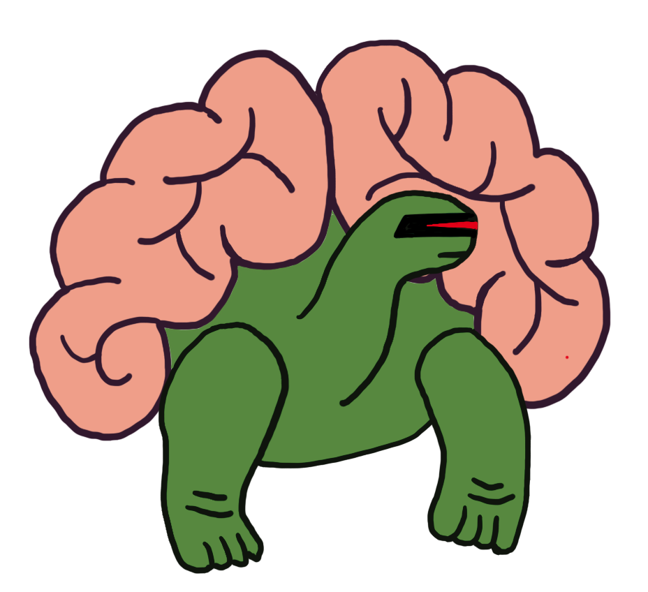

[](https://travis-ci.org/jeffreyksmithjr/galapagos_nao)
[](https://codebeat.co/projects/github-com-jeffreyksmithjr-galapagos_nao-master)
# Galápagos Nǎo
_A playground for continuous, interactive neuroevolution_

## Overview
Galápagos Nǎo is intended to allow for the exploration of these ideas about machine learning:
* [Neuroevolution](https://en.wikipedia.org/wiki/Neuroevolution)-the learning of deep learning architectures
* [Interactive evolution](https://en.wikipedia.org/wiki/Interactive_evolutionary_computation)-the use of human intelligence to guide evolution computation
* [Continuous learning](http://continuousai.com/background/)-defining machine learning tasks to run idefinitely, while retaining learned knowledge

From a programming perspective, it allows developers to explore:
* Integration of foreign language components
* Metaprogramming
* Functional programming techniques for machine learning

## Installation

Since this library uses both Elixir and Python, the easiest way of getting started is to pull the latest Docker image: [jeffreyksmithjr/galapagos_nao](https://hub.docker.com/r/jeffreyksmithjr/galapagos_nao/)

## Getting Started

To see an example execution, you can use the provided example data.

```
iex(1)> example_task = GN.Example.short_example()
Generations remaining: 2
Epoch 0. Loss: 1.82401811845, Train_acc 0.850116666667, Test_acc 0.8553
Epoch 0. Loss: 1.78003315557, Train_acc 0.844516666667, Test_acc 0.853
Epoch 0. Loss: 2.21335139497, Train_acc 0.871866666667, Test_acc 0.8784
Epoch 0. Loss: 3.6475392971, Train_acc 0.7559, Test_acc 0.76
...
```

This will spawn a series of Tasks which will asynchronously execute.
At the end of each generation, the best learned models will be stored in the `Selection` process.

These best models can be inspected at the end of the learning process or during it.

```
iex(2)> GN.Selection.get_all()
%{
  1 => %GN.Network{
    id: "0c2020ad-8944-4f2c-80bd-1d92c9d26535",
    layers: [
      dense: [64, :softrelu],
      batch_norm: [],
      activation: [:relu],
      dropout: [0.5],
      dense: [63, :relu]
    ],
    test_acc: 0.8553
  },
  2 => %GN.Network{
    id: "0c2020ad-8944-4f2c-80bd-1d92c9d26535",
    layers: [
      dense: [64, :relu],
      batch_norm: [],
      batch_norm: [],
      dropout: [0.5],
      dense: [64, :relu],
      leaky_relu: [0.2],
      batch_norm: []
    ],
    test_acc: 0.8784
  }
}
```

## Continuous Learning
Since the processes of learning and inspecting the results can occur concurrently, learning can continue indefinitely.
```
iex(3)> GN.Example.infinite_example()
%Task{
  owner: #PID<0.171.0>,
  pid: #PID<0.213.0>,
  ref: #Reference<0.1968944036.911736833.180535>
}
Generations remaining: infinity
```

The best learned models can be inspected at any time and then used without interrupting the continuous learning process.

```
iex(4)> GN.Selection.get_all()
%{
  1 => %GN.Network{
    id: "1b2d4f81-7a64-4529-92ed-74a7257fc00e",
    layers: [batch_norm: [], flatten: [], dense: [63, :none], flatten: []],
    test_acc: 0.8623
  }, 
  2 => %GN.Network{
    id: "1b2d4f81-7a64-4529-92ed-74a7257fc00e",
    layers: [
      dense: [64, :relu],
      batch_norm: [],
      leaky_relu: [0.4531755308368629],
      dense: [62, :none],
      flatten: [],
      leaky_relu: [0.06572503974712329],
      dense: [64, :none]
    ],
    test_acc: 0.8717
  }
}
```

## Interactive Neuroevolution

Continuous learning processes work well in combination with the interactivity functionality Via the functions exposed by the `Parameters` module, the user can guide the evolution of new architectures, according to human intuition.

```
iex(5)> GN.Parameters.put(GN.Selection, %{complexity_levels: 4})
:ok
```

The learning process will then pick up these new parameters and alter the behavior of the evolutionary system on the next generation.

```
iex(6)> GN.Selection.get_all()                                  
%{
  1 => %GN.Network{
    id: "1b2d4f81-7a64-4529-92ed-74a7257fc00e",
    layers: [
      batch_norm: [],
      activation: [:tanh],
      dense: [63, :none],
      flatten: []
    ],
    test_acc: 0.8653
  },
  2 => %GN.Network{
    id: "1b2d4f81-7a64-4529-92ed-74a7257fc00e",
    layers: [
      dense: [64, :relu],
      batch_norm: [],
      leaky_relu: [0.4531755308368629],
      dense: [62, :none],
      flatten: [],
      leaky_relu: [0.06572503974712329], 
      dense: [64, :none]
    ],
    test_acc: 0.8717
  },
  3 => %GN.Network{
    id: "1b2d4f81-7a64-4529-92ed-74a7257fc00e", 
    layers: [
      batch_norm: [],
      activation: [:tanh],
      dense: [65, :softrelu],
      flatten: []
    ],
    test_acc: 0.8612
  },
  4 => %GN.Network{
    id: "1b2d4f81-7a64-4529-92ed-74a7257fc00e",
    layers: [
      dense: [64, :none],
      batch_norm: [],
      dropout: [0.5],
      leaky_relu: [0.2],
      leaky_relu: [0.06572503974712329],
      flatten: [],
      dense: [65, :none]
    ],
    test_acc: 0.8464
  }
}
```
